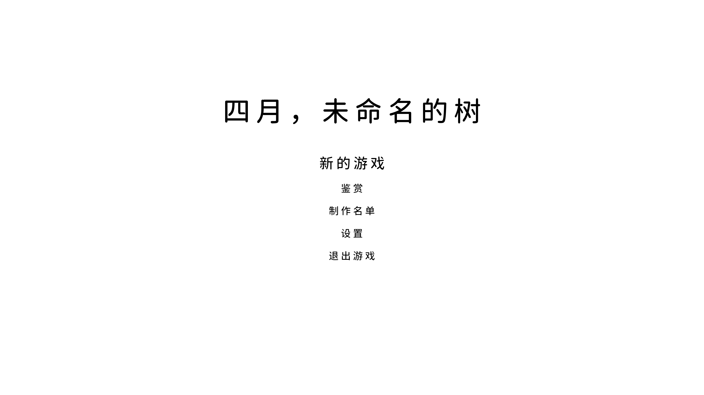
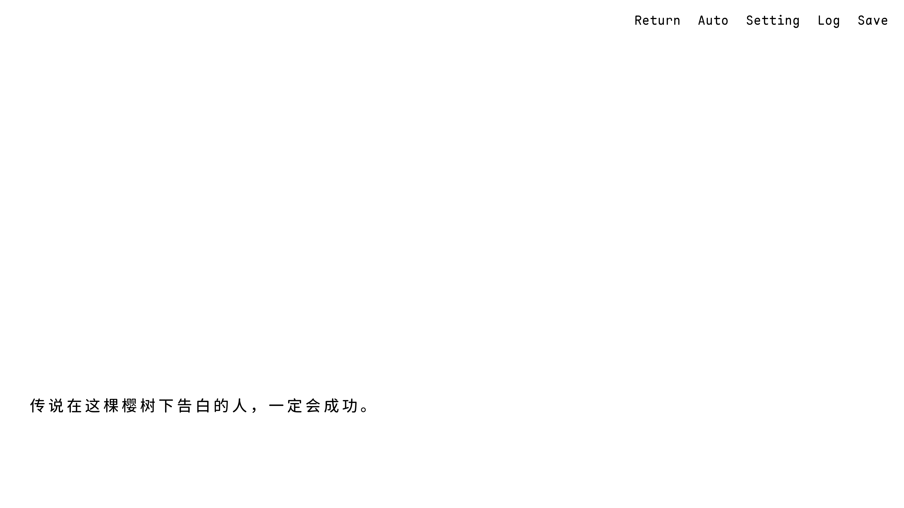

# 四月，未命名的树

本地文字冒险（ADV）。Windows 10+ 与 Android 5.0+。无网页版。

本版本无正式美术、音乐、语音；画面为白底黑字占位。许可证待填。





## 开发

- 引擎：**Ren'Py 8.5.3.26051504**（SDK 里的 Launcher）。不要用系统 Python 跑游戏，不要用 8.5.4 nightly 打本仓库的包。
- 编辑器：Cursor Profile **Py Dev**。工作区 `.vscode/` 已在仓库里，见 [`Docs/Dev/调研/开发环境.md`](Docs/Dev/调研/开发环境.md)。
- 开发文档入口：[`Docs/Dev/README.md`](Docs/Dev/README.md)
- 小版本 TODO：[`Docs/Ver/README.md`](Docs/Ver/README.md)
- 剧本：`Docs/Res/剧本.txt`（不要改）

Launcher 的工程目录应设成上一级 `Renpy_Projects`，让列表里出现 `Sakura`。不要把工程目录设成本仓库根，否则会找不到项目。

```text
Docs/     开发文档、小版本 TODO、文档资源（剧本源与展示截图；不进玩家包）
game/     运行时：脚本、系统、UI、数据、白占位图、字体
```

出包：Launcher 构建 Windows（再改压 `.7z`）与 Android Universal APK。不要构建网页。出包前跑 Lint，并勾 [`Docs/Dev/测试/验收清单.md`](Docs/Dev/测试/验收清单.md)。构建产物和 `.keystore` 不要进 git。

Win 存档在用户目录（`%APPDATA%\RenPy\AprilUnnamedTree\`），不在安装包里。

## 玩家

从 [Releases](https://github.com/ComeCatchMoonLa/April-Unnamed-Tree/releases) 下载 `April-Unnamed-Tree-win-v*.7z` 或 `April-Unnamed-Tree-android-v*.apk`。需要 Windows 10+ 或 Android 5.0+。不需要安装 Ren'Py SDK。

本版本无语音、无正式美术、无音乐。单存档、无回滚。玩家向约定见 [`Docs/Dev/Git/GitHub展示.md`](Docs/Dev/Git/GitHub展示.md)。
